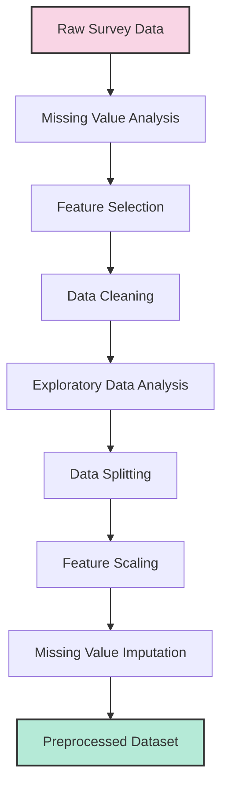
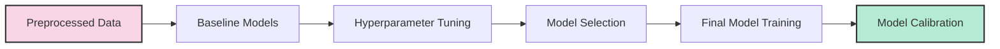
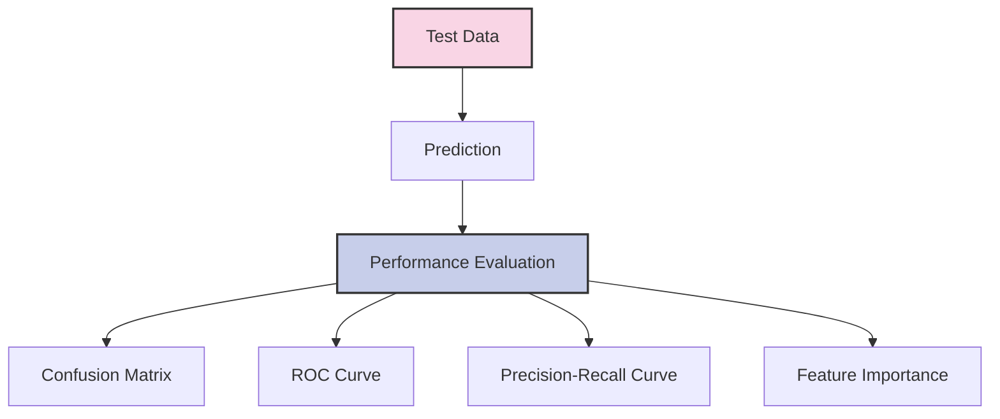
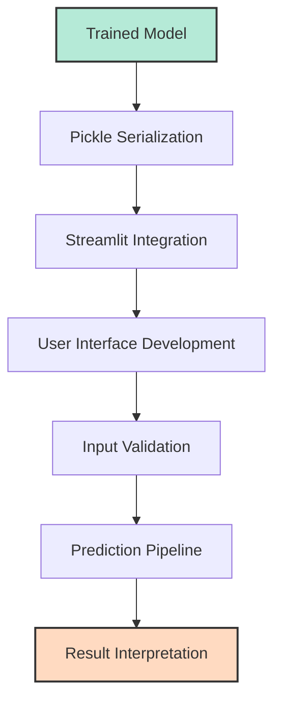

# Diabetes Risk Prediction Model Documentation

This document provides detailed information about the machine learning model used in the Diabetes Risk Prediction Tool, including its development process, training methodology, and performance evaluation.

## Table of Contents
- [Data Sources](#data-sources)
- [Data Preprocessing](#data-preprocessing)
- [Feature Engineering](#feature-engineering)
- [Model Training](#model-training)
- [Model Calibration](#model-calibration)
- [Performance Evaluation](#performance-evaluation)
- [Threshold Optimization](#threshold-optimization)
- [Model Deployment](#model-deployment)
- [Future Improvements](#future-improvements)

## Data Sources

The model was trained using data from the **CDC's Behavioral Risk Factor Surveillance System (BRFSS)**. While the exact years used aren't specified in this version, the development likely utilized recent data, potentially including the **2023 BRFSS dataset**.

BRFSS is the largest continuously conducted health survey system in the world, collecting state-level data via telephone interviews (landline and cell) from U.S. adults regarding health behaviors, chronic conditions, and preventive care.

Key characteristics of the training data (derived from BRFSS):
- **Source Type:** Population-based, state-level telephone health survey.
- **Collection:** Annually collected by the CDC across most US states and territories.
- **Content:** Self-reported information on demographics, health status, risk behaviors, chronic conditions, etc.
- **Size (e.g., 2023):** Over 400,000 records annually (433,323 in 2023).
- **Structure:** Mix of categorical and numerical features, utilizing complex sampling weights.
- **Target:** Contains information about individuals both with and without diabetes, enabling supervised learning for risk prediction.

*Note:* The specific preprocessing steps detailed below were applied to the selected BRFSS data subset used for this model.

## Data Preprocessing

Before training the model, the data underwent several preprocessing steps:

### Missing Value Analysis
- Identified patterns of missing data
- Determined appropriate imputation strategies for different features
- Removed features with excessive missing values (>30%)

### Feature Selection
The final model uses 38 features, selected based on:
- Medical literature on diabetes risk factors
- Statistical significance in univariate analysis
- Feature importance in preliminary models
- Domain expertise on diabetes risk factors

### Data Cleaning
- Handled outliers using capping at 5th and 95th percentiles
- Standardized coding for categorical variables
- Removed duplicate records and inconsistent data entries

### Exploratory Data Analysis
- Analyzed distributions of individual features
- Examined correlations between features
- Identified class imbalance (fewer diabetes cases than non-diabetes)

### Data Splitting
- Training set (70%): Used for model training
- Validation set (15%): Used for hyperparameter tuning
- Test set (15%): Used for final evaluation

## Feature Engineering

Several engineered features were created to improve model performance:

### Compound Features
- **AGE_BMI**: Interaction between age and BMI
- **AGE_BP**: Interaction between age and blood pressure status

### Feature Encoding
- One-hot encoding for categorical variables
- Ordinal encoding for ordered categorical variables (like health status ratings)

### Feature Scaling
- Numerical features standardized using StandardScaler
- Scaling parameters saved in `scaler.pkl` for use in prediction

### Missing Value Imputation
- Numeric features: Imputed with median values
- Categorical features: Imputed with mode values
- Imputation model saved in `imputer.pkl`

## Model Training

The model development process involved testing multiple algorithms before selecting the final model architecture.

### Baseline Models
Several algorithms were evaluated as baseline models:
- Logistic Regression
- Random Forest
- Gradient Boosting
- Support Vector Machine
- XGBoost

### Model Selection
XGBoost was selected as the best-performing base algorithm based on:
- Overall accuracy and F1 score
- Cross-validation performance
- Balance of precision and recall
- Computational efficiency

### Hyperparameter Tuning
The XGBoost model was optimized using:
- Grid search for major parameters
- Bayesian optimization for fine-tuning
- 5-fold cross-validation to prevent overfitting

The final XGBoost model parameters:
- `max_depth`: 5
- `learning_rate`: 0.05
- `n_estimators`: 200
- `subsample`: 0.8
- `colsample_bytree`: 0.8
- `min_child_weight`: 3
- `gamma`: 0.1

## Model Calibration

To improve the reliability of probability estimates, the model was calibrated using:
- Platt scaling (logistic regression on model outputs)
- 5-fold cross-validation to ensure robustness
- Preservation of ranking performance while improving probability calibration

The calibrated model (stored in `calibrated_model.pkl`) produces well-calibrated probability scores that can be interpreted as actual risk percentages.

## Performance Evaluation

The model was evaluated on a held-out test set using multiple metrics:

### Key Metrics
- **Precision**: 54.5% (of those predicted to have diabetes, this percentage actually have it)
- **Recall**: 38.9% (of all people with diabetes, this percentage are correctly identified)
- **F1 Score**: 45.4% (harmonic mean of precision and recall)
- **AUC-ROC**: 0.73 (model's ability to distinguish between classes)

### Confusion Matrix

|               | Predicted Negative | Predicted Positive |
|---------------|-------------------:|-------------------:|
| **Actually Negative** | 83.1% (True Negative) | 16.9% (False Positive) |
| **Actually Positive** | 61.1% (False Negative) | 38.9% (True Positive) |

### Top Feature Importance
The most influential features in the model, ranked by importance:
1. BMI Category
2. Age Group
3. General Health Status
4. Physical Health Days
5. Exercise Status
6. Age-BMI Interaction
7. Heart Disease History
8. Smoking Status
9. Alcohol Consumption
10. Mental Health Days

## Threshold Optimization

The classification threshold was optimized to balance:
- Precision: Avoiding unnecessary anxiety from false positives
- Recall: Identifying as many at-risk individuals as possible
- Clinical relevance: Aligning with diabetes risk screening goals

The optimal threshold (0.41) was determined using:
- F-beta score optimization (with beta=1.3 to weight recall slightly higher)
- Precision-recall curve analysis
- Consideration of the cost of false positives vs. false negatives

The threshold is stored in `optimal_threshold.json` and used to classify risk scores into "lower" and "higher" risk categories.

## Model Deployment

The trained model was deployed as part of a Streamlit web application:

### Serialized Components
- `calibrated_model.pkl`: The calibrated XGBoost model
- `scaler.pkl`: Feature scaling transformer
- `imputer.pkl`: Missing value imputation transformer
- `feature_list.json`: Required features in correct order
- `model_metadata.json`: Model version and performance metrics
- `optimal_threshold.json`: Classification threshold

### Prediction Pipeline
1. Collect user inputs through web interface
2. Preprocess inputs to match training features
3. Apply imputation for any missing values
4. Scale features using saved scaler
5. Generate probability prediction with model
6. Apply threshold to determine risk category
7. Present results with appropriate context and recommendations

## Future Improvements

Several opportunities exist for improving the model in future iterations:

### Data Enhancements
- Incorporate lab test values (glucose, HbA1c) where available
- Add family history of diabetes as a feature
- Include more detailed medical history features

### Model Improvements
- Test deep learning approaches for higher accuracy
- Explore ensemble methods combining multiple model types
- Implement automated retraining with new data

### Application Enhancements
- Add personalized intervention recommendations
- Develop longitudinal tracking of risk changes
- Create API for integration with healthcare systems

---

**Note**: This documentation reflects the current state of the model as of version 1.0.0. Future updates may incorporate additional features and improvements. 