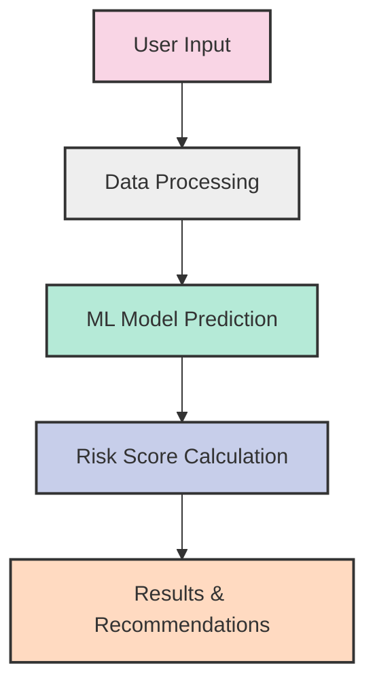
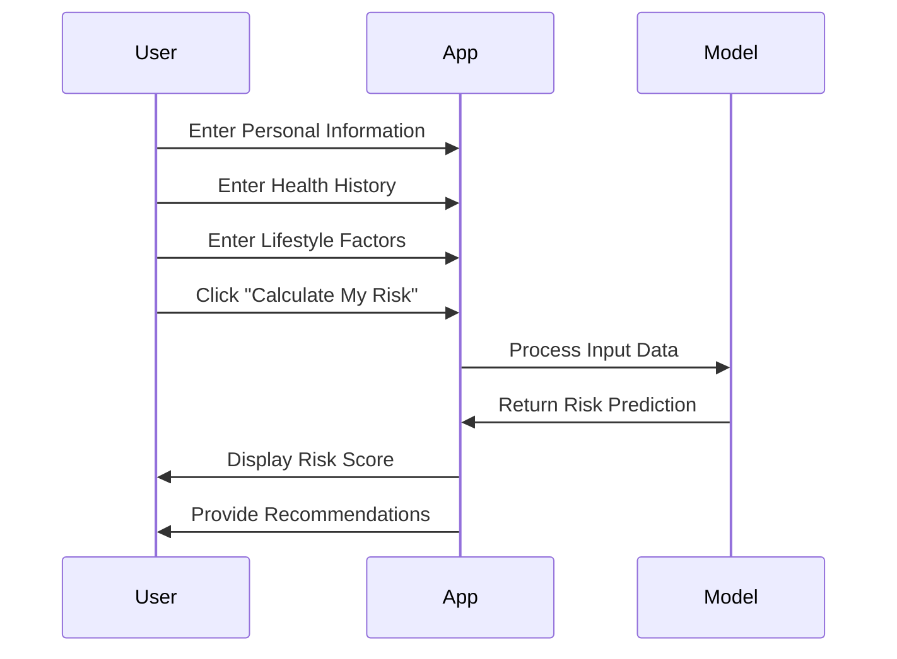
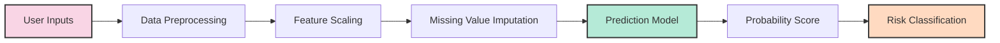
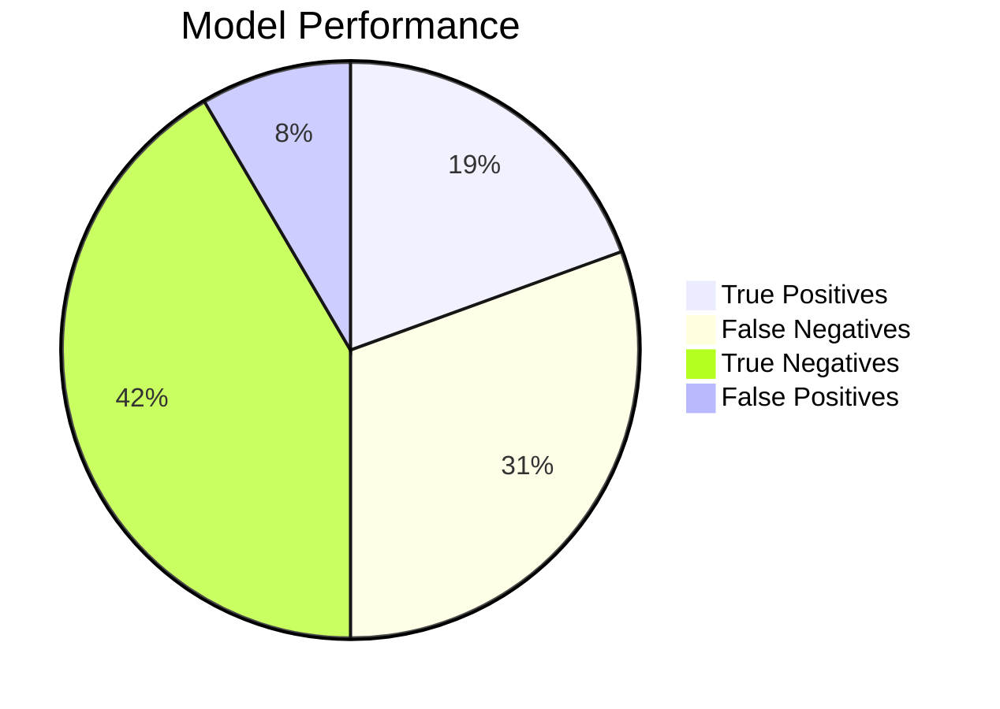

# Diabetes Risk Prediction Tool

A machine learning-based application that predicts type 2 diabetes risk based on health, lifestyle, and demographic factors. This tool uses a calibrated XGBoost model trained on health survey data to provide personalized risk assessments.


## Table of Contents
- [Diabetes Risk Prediction Tool](#diabetes-risk-prediction-tool)
  - [Table of Contents](#table-of-contents)
  - [Overview](#overview)
  - [Features](#features)
  - [Project Structure](#project-structure)
  - [Installation](#installation)
    - [Setup with Conda Environment](#setup-with-conda-environment)
    - [Setup with pip](#setup-with-pip)
  - [Usage](#usage)
  - [Model Information](#model-information)
    - [Data Flow](#data-flow)
  - [Risk Factors](#risk-factors)
    - [Personal Factors](#personal-factors)
    - [Health History Factors](#health-history-factors)
    - [Lifestyle Factors](#lifestyle-factors)
  - [Development Pipeline](#development-pipeline)
  - [Performance Metrics](#performance-metrics)
  - [Limitations and Disclaimers](#limitations-and-disclaimers)
  - [Contributing](#contributing)

## Overview

The Diabetes Risk Prediction Tool is a Streamlit-based web application designed to help individuals assess their risk for developing type 2 diabetes. By analyzing various health metrics and lifestyle factors, the tool calculates a personalized risk score and provides recommendations based on that assessment.

This project combines medical knowledge about diabetes risk factors with machine learning to create an accessible tool for preventive health screening.



## Features

- **Comprehensive Assessment**: Evaluates 18+ risk factors across personal, health history, and lifestyle categories
- **Educational Interface**: Provides detailed explanations of how each factor affects diabetes risk
- **Interactive Design**: User-friendly form with progress tracking and descriptive input fields
- **Personalized Results**: Risk score calculation with recommendations based on individual profiles
- **Transparent Algorithm**: Detailed information about the model and its performance metrics

## Project Structure

```
diabetes-risk-prediction/
│
├── app.py                    # Streamlit application code
├── calibrated_model.pkl      # Trained and calibrated machine learning model
├── scaler.pkl                # Standardization scaler for data preprocessing
├── imputer.pkl               # Imputer for handling missing values
├── feature_list.json         # List of features used by the model
├── feature_list.txt          # Text version of feature list
├── model_metadata.json       # Model version, metrics and parameters
├── optimal_threshold.json    # Classification threshold for risk prediction
├── requirements.txt          # Python dependencies
└── README.md                 # Project documentation
```

## Installation

### Setup with Conda Environment

1. Clone this repository:
```bash
git clone https://github.com/yourusername/diabetes-risk-prediction.git
cd diabetes-risk-prediction
```

2. Create the conda environment:
```bash
conda env create -f environment.yml
```

3. Activate the environment:
```bash
conda activate diabetes-ml
```

4. Run the Streamlit app:
```bash
streamlit run app.py
```

### Setup with pip

1. Clone this repository:
```bash
git clone https://github.com/yourusername/diabetes-risk-prediction.git
cd diabetes-risk-prediction
```

2. Install the required packages:
```bash
pip install -r requirements.txt
```

3. Run the Streamlit app:
```bash
streamlit run app.py
```

The application will start and open in your default web browser at http://localhost:8501

## Usage

1. Navigate through the three tabs (Personal, Health History, and Lifestyle) and fill in your information
2. Follow the progress bar that shows how much of the form you've completed
3. Click the "Calculate My Risk" button when you've entered all your information
4. Review your risk assessment results and recommendations
5. Explore the About tab to learn more about diabetes risk factors and the model



## Model Information

The prediction system uses a calibrated XGBoost classifier model trained on data from the CDC's Behavioral Risk Factor Surveillance System (BRFSS), likely incorporating data up to the 2023 survey. BRFSS is a large, nationwide telephone survey collecting health-related data.

- **Data Source**: CDC BRFSS (Behavioral Risk Factor Surveillance System) - Self-reported telephone survey data.
- **Model Type**: `CalibratedClassifierCV` wrapping an XGBoost base estimator. Calibration (Platt scaling) ensures probability outputs are reliable risk percentages.
- **Version**: 1.0.0
- **Features**: 38 selected health, demographic, and lifestyle variables (See `MODEL_DOCUMENTATION.md` for details).
- **Preprocessing**: Missing value imputation (median/mode) and standardization (StandardScaler).
- **Classification Threshold**: 0.41 (optimized to balance identifying potential cases (recall) and avoiding false alarms (precision)).

### Data Flow



## Risk Factors

The model considers various risk factors, grouped into three main categories:

### Personal Factors
- **Age**: Risk increases significantly after 45; doubles for each decade thereafter
- **BMI/Weight**: One of the strongest predictors; BMI over 30 increases risk by 7x
- **Income Level**: Affects access to healthcare, nutrition, and physical activity opportunities

### Health History Factors
- **General Health Status**: Self-reported health strongly correlates with diabetes risk
- **Cardiovascular Conditions**: Share many risk pathways with diabetes (inflammation, metabolic dysfunction)
- **Kidney Disease**: Bidirectional relationship with diabetes risk
- **Mental Health**: Depression and chronic stress affect hormones that regulate blood glucose

### Lifestyle Factors
- **Physical Activity**: Regular exercise can reduce risk by 30-50%
- **Smoking**: Increases risk by 30-40% through inflammation and pancreatic cell damage
- **Alcohol Consumption**: Complex relationship; moderate consumption may be protective

## Development Pipeline

The application was developed through the following pipeline:

```mermaid
graph LR
    A[Data Collection] --> B[Data Cleaning & Preprocessing]
    B --> C[Feature Engineering]
    C --> D[Model Training]
    D --> E[Model Calibration]
    E --> F[Threshold Optimization]
    F --> G[Model Evaluation]
    G --> H[Web App Development]
    H --> I[Deployment]
    
    style D fill:#b5ead7,stroke:#333,stroke-width:2px
    style E fill:#b5ead7,stroke:#333,stroke-width:2px
    style H fill:#ffdac1,stroke:#333,stroke-width:2px
```



## Performance Metrics

The model has been evaluated with the following performance metrics:

- **Precision**: 54.5% (of those predicted to have diabetes, this percentage actually have it)
- **Recall**: 38.9% (of all people with diabetes, this percentage are correctly identified)
- **F1 Score**: 45.4% (harmonic mean of precision and recall)
- **AUC-ROC**: 0.73 (model's ability to distinguish between positive and negative cases)



## Limitations and Disclaimers

This tool has several important limitations to keep in mind:

- It relies on self-reported information which may not be completely accurate
- It cannot replace laboratory tests such as blood glucose measurements
- It doesn't account for family history of diabetes, which is a significant risk factor
- Genetic factors that influence diabetes risk are not captured
- The model provides population-level estimates, not individualized biological assessments

**Disclaimer**: This tool provides an estimate based on the information provided. It does not constitute medical advice. Please consult with a healthcare provider for proper diagnosis and treatment.

## Contributing

Contributions to improve the tool are welcome. Please follow these steps:

1. Fork the repository
2. Create your feature branch (`git checkout -b feature/amazing-feature`)
3. Commit your changes (`git commit -m 'Add some amazing feature'`)
4. Push to the branch (`git push origin feature/amazing-feature`)
5. Open a Pull Request