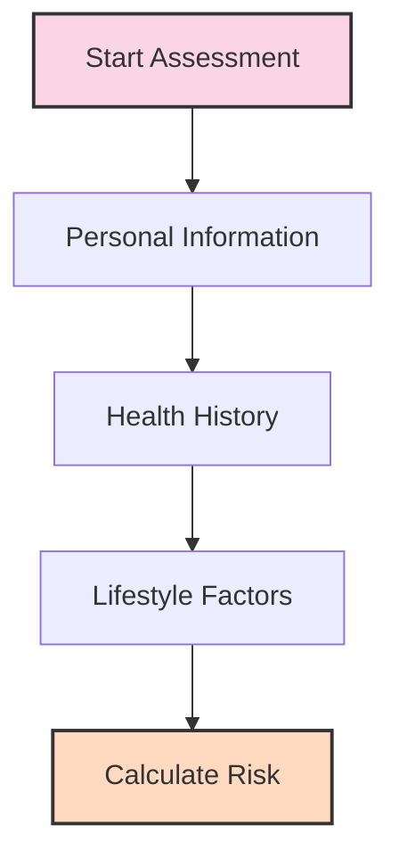
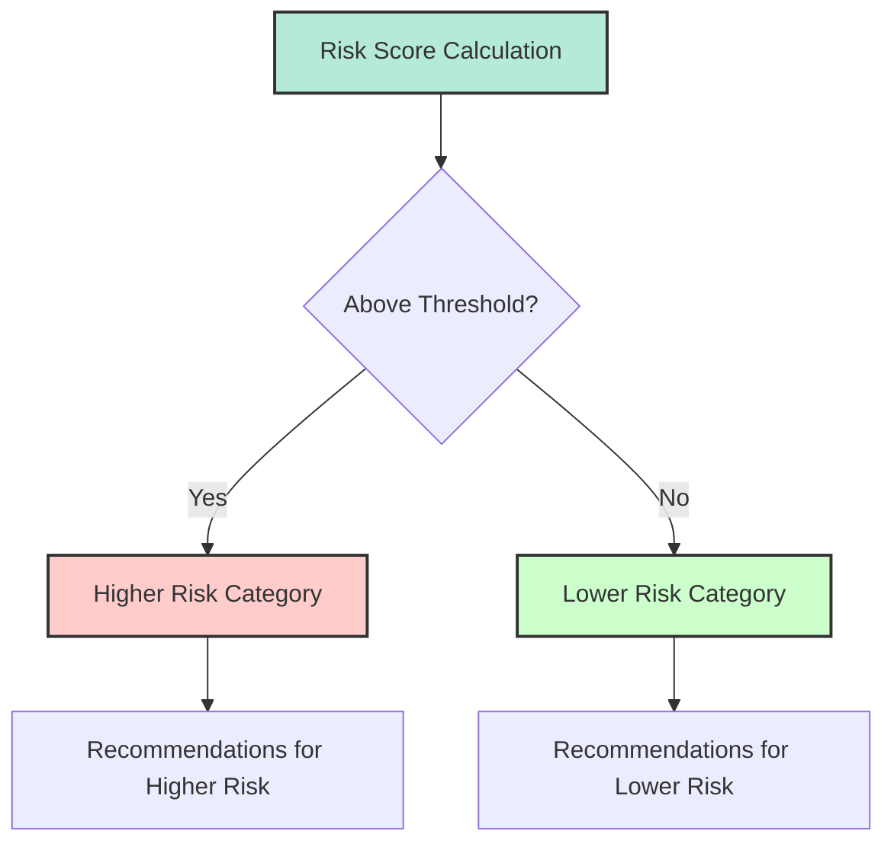

# Diabetes Risk Prediction Tool: User Guide

This guide provides instructions on how to use the Diabetes Risk Prediction Tool, understand your results, and take appropriate next steps based on your risk assessment.

## Table of Contents
- [Getting Started](#getting-started)
- [Completing the Assessment](#completing-the-assessment)
- [Understanding Your Results](#understanding-your-results)
- [Taking Action](#taking-action)
- [Frequently Asked Questions](#frequently-asked-questions)

## Getting Started

The Diabetes Risk Prediction Tool is a web-based application that helps you assess your risk for developing type 2 diabetes based on your personal health information, medical history, and lifestyle factors.

### Accessing the Tool

1. Open your web browser and navigate to the application URL
2. The tool will load with the Risk Assessment tab open by default
3. Begin by reviewing the information presented on the screen

### Before You Begin

Before starting the assessment, please note:
- This tool provides an estimate only and is not a medical diagnosis
- Your information is not stored or shared when using this tool
- You'll need to know basic information about your health status
- More complete and accurate information leads to better risk estimates

## Completing the Assessment

The assessment form is divided into three tabs to make it easier to complete:

### 1. Personal Information

This section collects basic demographic and physical information:

- **Age Group**: Select your age range from the dropdown menu
- **Weight**: Enter your weight in kilograms (kg)
- **BMI Category**: Select your Body Mass Index category
  - If you don't know your BMI, you can calculate it [here](https://www.nhlbi.nih.gov/health/educational/lose_wt/BMI/bmicalc.htm)
- **Income Category**: Select your household income range

Each field includes helpful information about how this factor affects diabetes risk. Click the "?" icon next to each field to learn more.

### 2. Health History

This section collects information about your general health and medical conditions:

**General Health Status**
- **Overall Health**: How would you rate your general health?
- **Days Physical Health Not Good**: How many days in the past month was your physical health not good?
- **Days Mental Health Not Good**: How many days in the past month was your mental health not good?

**Medical Conditions**  
Indicate whether you have been diagnosed with any of these conditions:
- Heart Attack History
- Coronary Heart Disease
- Stroke History
- Asthma
- Cancer History
- Kidney Disease

### 3. Lifestyle Factors

This section collects information about lifestyle factors that affect diabetes risk:

- **Exercise**: Have you participated in physical activity or exercise in the past 30 days?
- **Smoking History**: Have you smoked at least 100 cigarettes in your entire life?
- **Current Smoking Status**: Do you currently smoke every day, some days, or not at all?
- **Alcohol Consumption**: How many days per week do you consume alcoholic beverages?
- **Arthritis**: Have you been diagnosed with arthritis?
- **Depression**: Have you ever been diagnosed with depression?

### Progress Tracking

As you complete the form:
- A progress bar at the top shows how much of the assessment you've completed
- You must complete the form to receive an accurate risk assessment
- Fields with missing information will be highlighted

### Calculating Your Risk

After completing all sections:

1. Review your answers for accuracy
2. Click the "Calculate My Risk" button at the bottom of the form
3. Wait a few moments while the system processes your information
4. Your results will appear on the same page

## Understanding Your Results

The results section provides your diabetes risk assessment:

### Risk Score

Your risk score is presented as a percentage (e.g., 35.2%), which represents the probability of having or developing diabetes based on your risk factors. This score is compared to a threshold value of approximately 41%.

### Risk Categories

Based on your score, you'll be placed in one of two categories:

**Lower Risk** (Score below threshold)
- Your current combination of risk factors suggests a lower likelihood of having or developing diabetes compared to the general population
- This doesn't mean no risk, just lower relative risk

**Higher Risk** (Score above threshold)
- Your combination of risk factors indicates a higher likelihood of having or developing diabetes
- This doesn't mean you definitely have diabetes, just higher relative risk

### Interpreting Your Result

Remember these important points when considering your result:
- The tool calculates a statistical probability, not a definite outcome
- The threshold is set to balance false positives and false negatives
- Even a "lower risk" result doesn't mean zero risk
- The tool doesn't account for all possible risk factors (like family history)

## Taking Action

Based on your risk category, consider these next steps:

### For Higher Risk Results

1. **Consult a Healthcare Provider**
   - Share your risk assessment results with your doctor
   - Discuss getting a blood glucose test or HbA1c test
   - Ask about a comprehensive diabetes screening

2. **Consider Lifestyle Modifications**
   - Increase physical activity (aim for 150 minutes per week)
   - Improve diet (reduce processed foods and sugars)
   - Maintain a healthy weight or work toward weight loss if needed
   - Quit smoking if applicable
   - Limit alcohol consumption

3. **Monitor Your Health**
   - Be aware of diabetes symptoms (increased thirst, frequent urination, unexplained weight loss)
   - Consider regular follow-up appointments with your healthcare provider

### For Lower Risk Results

1. **Maintain Healthy Habits**
   - Continue with regular physical activity
   - Maintain a balanced diet
   - Keep a healthy weight

2. **Regular Check-ups**
   - Continue routine healthcare visits
   - Consider periodic diabetes screening, especially after age 45

3. **Stay Informed**
   - Learn more about diabetes prevention
   - Reassess your risk periodically, especially if health factors change

## Frequently Asked Questions

**Q: Is this tool a substitute for medical advice?**  
A: No. This tool provides an estimate based on statistical models and cannot replace professional medical advice, diagnosis, or treatment. Always consult with qualified healthcare providers.

**Q: How accurate is this risk assessment?**  
A: The model has a precision of about 54.5% and recall of 38.9%. This means that of those predicted to have diabetes, about 54.5% actually have it, and of all people with diabetes, about 38.9% are correctly identified by the model.

**Q: What if I don't know some of my health information?**  
A: Provide as much accurate information as possible. Missing information might affect the accuracy of your risk assessment.

**Q: Does family history affect diabetes risk?**  
A: Yes, family history is a significant risk factor for type 2 diabetes. This tool currently doesn't include family history in its calculations, so consider this when interpreting your results.

**Q: Can I use this tool if I've already been diagnosed with diabetes?**  
A: This tool is designed for assessing the risk of developing type 2 diabetes in people who haven't been diagnosed. If you already have diabetes, please follow your healthcare provider's guidance for managing your condition.

**Q: How often should I reassess my risk?**  
A: Consider reassessing annually or whenever significant changes occur in your health, weight, or lifestyle.

---

Remember that this tool provides an estimate based on the information you provide. Many factors influence diabetes risk, and some important factors (like genetics and family history) aren't included in this assessment. The most reliable way to assess diabetes risk is through proper medical evaluation with laboratory testing. 